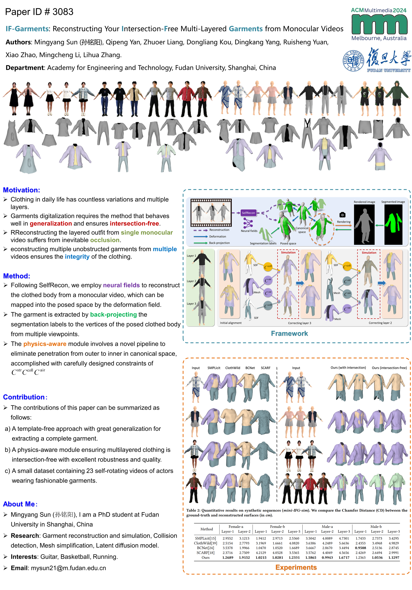
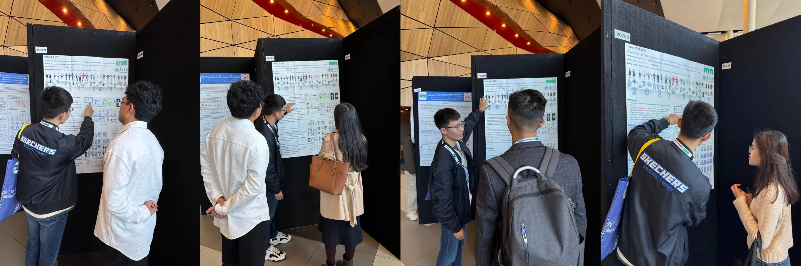

- **问题描述**：日常服装具有款式多样、多件搭配的特点，现有方案基于预定义服装模板，难以重建出复杂服装套装。
- **解决方案**：
  - 从单目视频中学习模板空间的符号距离场(SDF)、姿态空间的变形场，生成帧间拓扑一致的数字人几何；
  - 提出无模板服装提取算法，利用统一拓扑的几何通过逆投影聚合多帧分割信息。
  - 对于多件服装对齐导致的穿模问题，提出循环激活策略以改进XPBD的约束生成，并将模板空间的SDF作为碰撞检测器，可在3分钟内消除服装-服装、服装-身体之间的穿透。

