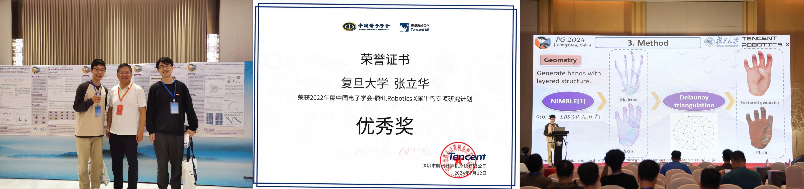

- **问题描述**：在人机物理交互中，机器人的操作要充分考虑人体的安全性和舒适性。由于人体生理结构复杂，现有的机器人仿真引擎难以模拟人体结构和机器人交互的接触。
- **解决方案**：
  - 提出具有"骨骼-肉-皮肤"生理结构的几何，并在XPBD仿真中提出骨骼刚性约束、肉附着约束、皮肤平滑约束来模拟各个部位的物理特性。
  - 提出多分辨率并行采样策略，将接触仿真的精度提升至**亚微米级**，比SOTA**降低10倍**，并且实时运行（**30fps**）。

[论文讲解文档](slides.pdf)

